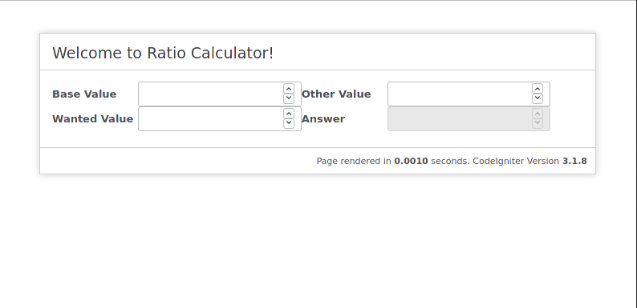

# Ratio Calculator

Simple proportion calculator based on php framework (Codeignitor 3).

## Features

1. Calculate the simple proportion between two numbers

## Installation

1. Copy all files inside a directory
2. Edit application/config/config.php ->  `$config['base_url']` to point to install url
